# Data Synchronisation Implementation Guideline for Polar BLE SDK Apps

## Introduction
Main use case of Polar BLE SDK is providing access to health and fitness data collected and created by Polar wearables: sports watches and heart rate/activity sensors. Polar BLE SDK allows connecting to Polar devices over Bluetooth Low Energy connection from applications running on iOS and Android mobile phones and tablets. SDK offers methods to configure the Polar devices for individual person's use, and allows retrieving data generated by the device. 

SDK is based on same architecture and protocols that Polar mobile apps use for data transfer, and offers APIs returning that data in a variety of useful data objects, depending on the capabilities of different Polar devices. SDK users do not need to concern themselves on low level details of the hardware components in devices, embedded software architecture, or internal protocols Polar devices use., However, understanding how to use the SDK functions in intended manner is required. 

This document aims to guide app developers using Polar BLE SDK to design and implement their data synchronisation implementation in a manner that is efficient, focuses on the data and functionalities they need in their use cases, and avoid overly aggressive syncing mechanisms that may lead to performance issues and bugs. It gives a generic blueprint for data sync implementations per app developer's data needs, and points out mandatory actions for successful data transfer.

## Terms used in this document

**Sensor device, Polar device, device, or sensor**
Polar wearable device capable of sensing values related to wearer's physiology, wearer's actions or environment. For example heart rate, location, skin temperature, acceleration etc.

**Mobile device**
Android or iOS device that is supported by Polar BLE SDK.

**SDK app or app**
Mobile app built using Polar BLE SDK, on iOS or Android mobile device.

**Synchronisation or syncing or sync**
Configuring device for data collection, transferring desired data between Polar devices and SDK app, and managing the transferred data both within device and within the app.

**Configuration**
Part of synchronisation where parameters and properties affecting device functionality are defined by user in the SDK app, and set on device using SDK methods.

**Streaming or online streaming**
Transfer of data from device to app that is continuous and near-real time in nature. For example, heart rate service, which provides wearer's current heart rate from device sensors at regular intervals using notification mechanism to the app, which is in turn listening to new values using SDK API method that allows observing the received values.

**Recording or offline recording**
Storing generated data by the device to device memory to be fetched later. 

**Fetching or retrieving**
Using SDK API to get the data that was stored on device. For example, offline recordings. Another example: fetching training session and exercise data stored on device based on starting and stopping a training session.

**Manual synchronisation or manual sync**
Synchronisation happening as immediate response to user action requesting synchronisation, from application UI.

**On-demand sync**
Synchronisation happening as immediate response to app function requiring certain latest data from device. Manual sync is user initiated on-demand sync.

**Automatic synchronisation or auto sync**
Polar devices performing synchronisation to Flow mobile app and to Flow web service. This synchronisation is based on devices notifying Polar Flow mobile app that has connection to the device that data sync should happen and Flow mobile app performing the synchronisation. Polar BLE SDK does not currently support reacting to this auto sync mechanism. SDK apps may implement  their own automatic synchronisation that are initiated by app logic, instead of device request.

**Background sync**
Synchronisation performed while SDK app is not actively being used by user, but is in background on user's mobile device.

**Timed sync**
Type of background sync that is initiated according to app defined schedule.

## Aspects of syncing

|                 | Data Access | Data Management | Configuration |
|-----------------|-------------|-----------------|---------------|
| **Scope**           | Transfer of latest data generated by device to SDK based app | Ensuring necessary and correct data is stored both on device and within app | Settings affecting and controlling data device produces |
| **Examples**     | Optimising data transfer for efficient and fast access to data  Possibly passing and/or storing received data from mobile device to related services in timely manner | Deleting data and controlling device memory usage  Controlling private data on device  Updating, merging, and deleting data on mobile device | Current user physical configuration: Height, Weight, Date of Birth, Maximum HR, Minimum HR, VO2Max, Training Background, Activity type, Sleep goal  Device time affecting time-related data values  SDK Mode allowing data capabilities that are not available by default  Values that control automatically triggering offline recording |

## Polar device and SDK platform considerations
Polar devices supported by SDK have limits on their capacities, such as processing power, current consumption considerations, memory limits, implementation of device software, and data transfer limits imposed by the BLE stack on the devices. 

Similar technical limits are applicable to phones and computers Polar SDK is run on.

Due the design of Polar devices within these limits, one should avoid calling multiple API methods to control device from multiple threads at the same time. SDK method calls to a single Polar device should be performed sequentially,  as the devices are designed to process underlying communications operations such as device data reads and writes sequentially. **So when implementing app functions that use SDK methods, please make sure control is returned to app code before executing next SDK API method call for the same device.**

SDK may interact with multiple Polar devices over BLE at the same time; however, parallel operations using SDK functions to many separate devices has not been extensively tested yet. For this reason, **it is also currently recommended that applications interact with only one device at a time.**

Sync activities can be performed both when app is in foreground and also while the app is in the background and user is not actively interacting with it. Follow platform guidelines on implementing the background sync process.

#### Useful background processing guides for iOS:
https://developer.apple.com/documentation/backgroundtasks
https://dev.to/arshtechpro/wwdc-2025-ios-26-background-apis-explained-bgcontinuedprocessingtask-changes-everything-9b5
### Useful background processing guide for Android:
https://developer.android.com/develop/background-work

## Efficient syncing checklist

- **Use sync start and stop methods to prepare device for data syncing.** 
    - Devices rely on these methods to make sure cached data is written to files for retrieval,  set optimised BLE communications parameters for faster data transfer, and ensure that device overall is ready for syncing operations.

- **Divide syncing process into stages of functional data domains relevant to your application**
    
    - Different data on device are updated at different times, so follow the pattern of data becoming available on device.

        - Sleep and nightly recharge data becomes available within 90 minutes after waking up. Get sleep status to ensure sleep data recording has been stopped by device, when stopped, data should be available for retrieval when device has recognised sleep correctly. App may also stop sleep using appropriate method. 
        
        - Exercise data is available when exercise has been completed.

        - 24/7 activity data is flushed to file for SDK APIs to read when sync start request method completes successfuilly, at midnight, or when USB cable is connected.

    - Transfer and remove data for a particular domain from device as soon as possible to free up device memory for new data and avoid losing data in case of device.
        - This applies to all devices, but is more important for devices with limited memory. Sensors such as Polar 360 and Verity Sense have less memory capacity compared to watches.
    - Make sure syncing associates collected data with correct user, if device is shared by multiple users.

- **Remember to update changed settings on device.**
    - Update changed settings for data collection from your app to the device according to the data collection needs.
        - Make sure device is updated with user specific configuration (physical info) per user when user changes, if device is used by multiple users.
        - Make sure features that you can turn off any features unneeded at least until next sync time, to avoid unnecessary processing and storage usage on device.
    - Check that device clock is up-to-date, set time as needed, using setLocalTime() method.

- **Optimise your sync process**
    - Sync more often with smaller amounts of data rather than rarely with large amounts of data.
    - Sync only changed data. Keep track of data that is already transferred. For many types of data, data is retrieved based on date and/or time associated to data by device. Date/time is then one straightforward way to identify data for keeping track of what data has been retrieved previously.
    - **Remove data already synced to free up memory on the device.** This is also a simple and effective way to ensure the data does not unnecessarily get synced multiple times.
    - Use straming data instead of relying stored device data if sufficient. Recording on device and fetching recorded data involves storing and transferring more data and leads  to increased battery consumption compared to listening to lean data streams.
    - Utilize available aggregated data when possible over raw data.
    - Avoid syncing more often than necessary or too early. Test collection data with projected usage patterns and plan sync intervals accordingly.

- **Coordinate your use of on-demand, manual, and background syncing** 
    - Typically for best user experience, combination of on-demand manual syncing of latest data as well as appropriate regular background syncing is used.
    - Manual data sync or per data fetch/update should be doing the appropriate data fetch or update operation that is relevant for the app function user is performing just then and there; and requiring latest data that device may have. 
    - Background sync should be implemented for scenarios where continuous data collection with little user active actions is a requirement.
    - Manual sync should pause any background sync from same device, to avoid conflict with file operations between the two sync processes, often performed using different threads within the app.
    - Manual sync should also allow to skip a pending background sync phase if same data is fresh enough from on-demand data sync.

## Sync flowchart for SDK based apps

Following flowchart depicts generic background sync flow that can be used as skeleton pseudo code for your app's syncing. Pick stages that are relevant for your application. For manual syncing, stages / substages within this flowchart can be selected per data need for specific user action.

---

## SDK API methods for syncing data

### Connect to device
`connectToDevice(identifier)`

### Data type specific sync phases 

When starting or resuming sync fetch phase, call
`sendInitializationAndStartSyncNotifications(identifier)`

App should not continue sync until this method returns success indicating device is ready for syncing data. Failure indicates device is not ready for syncing data.

One typical situation causing this is an ongoing training session, which causes device to respond to sync request with error 202 (SYSTEM_BUSY). Note that this may be returned by any SDK data fetch operation.

Depending on your application needs, you may be able to use either a single sync session, or it may be more robust to divide syncing into separate phases, each starting with sync start and ending with sync end calls.

Individual phase is best implemented as a state machine that is capable of resuming retrieving data from the point that was interrupted.  Typical interruptions include device temporarily disconnecting and soon after reconnecting again; or device switching to busy state, or any other similar recoverable failure.

For example, if syncing involves getting recorded accelerometer data, steps, sleep and 24/7 PPi samples, each one of these should be resumable stages in syncing. Once a stage has successfully completed, resuming should continue to next stage or phase.

A phase consisting of stages should check new data for the data type, retrieve new data, and finally remove data that has been successfully fetched. Note that removal methods are not completely independent per data type, so if there is a removal method that takes care of removing multiple types of data, that should be executed only after all data that would be removed has been successfully fetched first. 

At the end of successfully completed sync,  call
`sendTerminateAndStopSyncNotifications(identifier)`

Depending on your application needs, you may be able to use either a single sync session, or it may be more robust to divide syncing into separate phases, each wrapped within sync start and sync end calls.

#### Offline recordings

1. Stop ongoing offline recordings as appropriate, if not using automatic triggers and you want to get most recent data during data fetch phase or you want to e.g. record different data during different times of day.
2. Update device configuration if needed. For example setting or resetting SDK mode, and device time should be done between offline recordings if possible. 
3. Restart offline recordings for data that you want to collect next. Doing this as soon as possible should keep gaps for data collection at minimum for offline recordings.

|           | PolarOfflineRecordingApi |
|-----------|--------------------------|
| Data Types | <small>HR, ECG, ACC, PPG, PPI, GYRO, MAGNETOMETER, PRESSURE, LOCATION, TEMPERATURE, SKIN TEMPERATURE</small> |
| **Listing of available data types** | `getAvailableOfflineRecordingDataTypes` |
| **Getting ongoing recording for data type** |  `getOfflineRecordingStatus` |
| **Stop recording** | `stopOfflineRecording` |
| **Get available recording settings per data type** | `requestOfflineRecordingSettings` `requestFullOfflineRecordingSettings` |
| **Start recording** | `startOfflineRecording` |

4. Data fetch phase. Retrieve and remove recorded data from device.

|           | PolarOfflineRecordingApi (continued)|
|-----------|--------------------------|
| Data Types | <small>HR, ECG, ACC, PPG, PPI, GYRO, MAGNETOMETER, PRESSURE, LOCATION, TEMPERATURE, SKIN TEMPERATURE</small> |
| **Fetch methods** | `listOfflineRecordings`, `listSplitOfflineRecordings`, `getOfflineRecord`, `getSplitOfflineRecord` |
| **Removal methods** |  `removeOfflineRecord` [1] See also **PolarBleApi** `deleteDeviceDateFolders` [2] |
| **Notes** | All types of recordings are returned by `listOfflineRecordings` and `listSplitOfflineRecordings` methods   [1] `removeOfflineRecord` method removes specific offline recording. This includes all parts of large offline recording split across multiple files. If you wish to do as continuous offline recording as possible, and you have restarted offline recording to minimise gaps in data, be careful not to delete the latest and/or ongoing recordings.   [2] It can be more efficient to remove all offline recordings along with all other day specific data for given days, which can be done using `deleteDeviceDateFolders` method. But **do not remove data using `deleteDeviceDateFolders` for any date range you still want to read any already stored data from later**. Especially, if you delete device data for current day, be aware that only data for today after the operation will be data that device has cached to memory and not flushed to file system yet, plus data that will be collected after deleting the current day folder.

#### Activity and Nightly Recharge 

1. Fetch when new data is available, SDK APIs allow fetching data by date ranges
2. Remove data after fetching if data is from yesterday or earlier, or otherwise does not update any longer

<table>
  <tr>
    <th></th>
    <th colspan="7"  style="text-align: left;">
      PolarActivityApi 
    </th>
  </tr>
  <tr>
    <th style="text-align:left;">Data type</th>
    <th style="text-align:left;">Steps</th>
    <th style="text-align:left;">Distance</th>
    <th style="text-align:left;">Active Time</th>
    <th style="text-align:left;">Calories</th>
    <th style="text-align:left;">24/7 HR Samples</th>
    <th style="text-align:left;">24/7 PPI Samples</th>
    <th style="text-align:left;">Nightly Recharge</th>
  </tr>
  <tr>
    <td style="font-weight:bold;">Fetch methods</td>
    <td><code>getSteps</code></td>
    <td><code>getDistance</code></td>
    <td><code>getActiveTime</code></td>
    <td><code>getCalories</code></td>
    <td><code>get247HrSamples</code></td>
    <td><code>get247PpiSamples</code></td>
    <td><code>getNightlyRecharge</code></td>
  </tr>
  <tr>
    <td style="font-weight:bold;">Removal methods PolarBleApi</td>
    <td colspan="3">
      <code>deleteStoredDeviceData(ACTIVITY)</code> 
      <code>deleteDeviceDateFolders </code>[2]
    </td>
    <td>
      <code>deleteStoredDeviceData(DAILY_SUMMARY)</code> 
      <code>deleteDeviceDateFolders</code> [2]
    </td>
    <td colspan="2">
      <code>deleteStoredDeviceData(AUTO_SAMPLES)</code> 
      <code>deleteDeviceDateFolders</code> [2]
    </td>
    <td>
      <code>deleteStoredDeviceData(NIGHTLY_RECOVERY)</code> 
      <code>deleteDeviceDateFolders</code> [2]
    </td>
  </tr>
  <tr>
    <td style="font-weight:bold;">Notes</td>
    <td colspan="3" style="text-align:left;">
      Multiple types of data deleted simultaneously using ACTIVITY
    </td>
    <td></td>
    <td colspan="2" style="text-align:left;">
      Multiple types of data deleted simultaneously using AUTO_SAMPLES
    </td>
    <td></td>
  </tr>
  </table>

<table>
  <tr>
    <th></th>
    <th  style="text-align: left;">
      PolarSleepApi 
    </th>
    <th style="text-align: left;">
      PolarTemperatureApi 
    </th>
  </tr>
  <tr>
    <th style="text-align:left;">Data type</th>
    <th style="text-align:left;">Sleep start, stop, duration, stages</th>
    <th style="text-align:left;">Skin temperature details: sensor location, type of measurement, temperature samples</th>
  </tr>
  <tr>
    <td style="font-weight:bold;">Fetch methods</td>
    <td><code>getSleep</code></td>
    <td><code>getSkinTemperature</code></td>
  </tr>
  <tr>
    <td style="font-weight:bold;">Removal methods</td>
    <td><b>PolarBleApi</b> <code>deleteStoredDeviceData(SLEEP)</code> 
    <code>deleteStoredDeviceData(SLEEP_SCORE)</code>  
    <code>deleteDeviceDateFolders</code> [2]</td>
     <td><b>PolarBleApi</b> <code>deleteStoredDeviceData(SKIN_TEMP)</code> 
    <code>deleteStoredDeviceData(SKIN_CONTACT_CHANGES)</code>  
    <code>deleteDeviceDateFolders</code> [2]</td>
  </tr>
</table>

#### Training data

- Training data gets saved by user when training session is completed

- Training session API includes methods to start, pause, stop, and check status of training session

<table>
  <tr>
    <th></th>
    <th style="text-align: left;">
      PolarTrainingSessionApi 
    </th>
    <th style="text-align: left;">
      PolarH10OfflineExerciseApi 
    </th>
  </tr>
  <tr>
    <th style="text-align:left;">Data type</th>
    <th style="text-align:left;">Training sessions</th>
    <th style="text-align:left;">H10 exercises</th>
  </tr>
  <tr>
    <td style="font-weight:bold;">Fetch methods</td>
    <td>
      <code>getTrainingSessionReferences</code> 
      <code>getTrainingSession</code>
    </td>
    <td>
        <code>listExercises</code> 
        <code>fetchExercise</code>
    </td>
  </tr>
  <tr>
    <td style="font-weight:bold;">Removal methods</td>
    <td>
        <b>PolarBleApi</b> 
        <code>deleteDeviceDateFolders</code> [2]
    </td>
     <td><code>removeExercise</code></td>
  </tr>
  <tr>
    <td style="font-weight:bold;">Notes</td>
    <td>Currently removed only using deleteDeviceDateFolders(). This removes also ACTIVITY, DAILY_SUMMARY, NIGHTLY_RECOVERY, SLEEP, SLEEP_SCORE, SKIN_TEMP, SKIN_CONTACT_CHANGES data from same dates</td>
    <td>Specific to H10 Sensor</td>
  </tr>
</table>

### Completing sync

Terminate sync with device using the API method 
`sendTerminateAndStopSyncNotifications(identifier)`

Disconnect from device if no need to keep connected
`disconnectFromDevice(identifier)`

Perform local processing of fetched data.

Notify user of successful sync or unsuccessful sync and provide guidance on how to retry/recover without losing device data.

---

### Feedback to this document

We encourage feedback to this document. Syncing data is fundamental to SDK based apps and we acknowledge that general guidelines as well as SDK support for syncing can be improved. If you notice these guidelines are not helpful, or have suggestions please post a new issue with your questions or improvement ideas.

